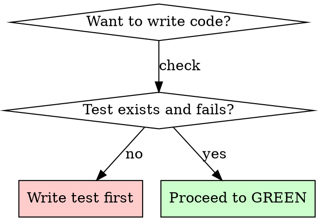

# TDD Subagent Workflow

Enforce strict Test-Driven Development by dispatching dedicated subagents for each phase of the Red-Green-Refactor cycle.

## Overview

Each feature is implemented through three phases, each handled by a dedicated subagent. The orchestrator (you) dispatches subagents via the Task tool and enforces strict phase gates between them.

## When to Use

- User requests TDD or test-driven development for a feature
- User asks to implement using red-green-refactor
- User explicitly invokes this workflow

## When NOT to Use

- Bug fixes where the failing test already exists (just fix the code)
- Documentation, configuration, or non-code changes
- Exploratory prototyping where the requirements are unclear

## Before Starting

1. Read the project's CLAUDE.md to understand test commands, conventions, and patterns
2. Break the user's request into discrete, testable features
3. Plan the order of implementation (simplest first)

## Workflow

### Phase 1: RED - Write Failing Test

Dispatch `tdd-workflow:tdd-test-writer` via the Task tool. Include in the prompt:
- The specific feature requirement
- Expected behavior to verify
- Project test conventions discovered from CLAUDE.md

**GATE: Do NOT proceed until the subagent confirms the test FAILS for the expected reason.**

If the subagent reports the test passes (feature already exists) or fails for an unexpected reason, stop and reassess before continuing.

### Phase 2: GREEN - Minimal Implementation

Dispatch `tdd-workflow:tdd-implementer` via the Task tool. Include in the prompt:
- Test file path and content from RED phase
- The failure output showing what needs to pass
- Feature requirement context

**GATE: Do NOT proceed until the subagent confirms ALL tests PASS.**

If the subagent reports test failures, do NOT proceed to refactor. The GREEN phase must achieve a passing test suite.

### Phase 3: REFACTOR - Improve Code Quality

Dispatch `tdd-workflow:tdd-refactorer` via the Task tool. Include in the prompt:
- Test file path
- Implementation files modified in GREEN phase
- Project conventions from CLAUDE.md

**GATE: Cycle complete when the refactor subagent returns with passing tests (or confirms no refactoring needed).**

## Multiple Features

Complete the full cycle for EACH feature before starting the next:

```
Feature 1: RED -> GREEN -> REFACTOR (complete)
Feature 2: RED -> GREEN -> REFACTOR (complete)
Feature 3: RED -> GREEN -> REFACTOR (complete)
```

Never interleave phases across features.

## Progress Reporting

Report each phase transition to the user:
- Starting RED phase: what behavior will be tested
- RED confirmed: test fails as expected
- Starting GREEN phase: implementing to pass the test
- GREEN confirmed: test passes
- Starting REFACTOR: evaluating improvements
- REFACTOR complete: summary of changes (or no changes needed)

## Phase Violations



Never:
- Write implementation before the test exists and fails
- Proceed to GREEN without confirmed test failure
- Skip REFACTOR evaluation
- Start a new feature before completing the current cycle
- Modify the test during GREEN phase (fix the implementation, not the test)
